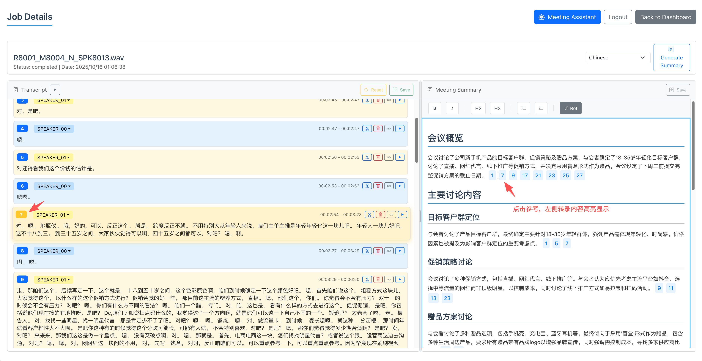

# Meeting ASR - Intelligent Multi-User Meeting Speech Transcription System

A modern multi-user meeting speech transcription (ASR) system built on FastAPI + React, supporting real-time speech recognition, intelligent punctuation, speaker diarization, asynchronous processing, and queue management.



## 📋 Table of Contents

- [Features](#-features)
- [System Requirements](#-system-requirements)
- [Quick Start](#-quick-start)
- [Detailed Installation Guide](#-detailed-installation-guide)
- [Database Initialization](#-database-initialization)
- [Administrator Setup](#-administrator-setup)
- [User Guide](#-user-guide)
- [API Documentation](#-api-documentation)
- [Deployment Guide](#-deployment-guide)
- [Troubleshooting](#-troubleshooting)
- [Project Structure](#-project-structure)
- [Contribution Guide](#-contribution-guide)
- [License](#-license)
- [Support](#-support)
- [Changelog](#-changelog)

## 🎯 Features

### Core Features
- **High-accuracy speech recognition**: FunASR-based Mandarin ASR with intelligent punctuation
- **Speaker diarization**: Automatically separates different speakers across the meeting
- **Real-time transcription**: Supports asynchronous transcription for audio and video sources
- **Intelligent queue management**: Multi-user asynchronous processing keeps jobs efficient

### Multi-User Support
- **User isolation**: Each user accesses only their own jobs and data
- **Concurrency limits**: Defaults to 2 concurrent jobs per user and 3 jobs system-wide; configurable via environment variables
- **Real-time queue status**: Track queue position and estimated wait time
- **Job cancellation**: Cancel jobs that have not yet started processing

### Advanced Features
- **Live status updates**: WebSocket pushes job progress instantly
- **Progress tracking**: Detailed view into each job lifecycle stage
- **Error recovery**: Resilient retry and error-handling mechanisms
- **File management**: Upload files up to 200 MB
- **Batch processing**: Queue and process multiple files at once

### Security and Administration
- **User management**: Three-tier roles (user, admin, super admin)
- **JWT authentication**: Secure user authentication and authorization
- **Admin dashboard**: Manage users, monitor jobs, and adjust system settings
- **Modern UI**: Responsive interface powered by Bootstrap 5

## 💻 System Requirements

### Minimum
- **Python**: 3.8+
- **Node.js**: 16.0+
- **RAM**: 4 GB (8 GB+ recommended)
- **Storage**: At least 2 GB of free space

### Recommended
- **Python**: 3.9+
- **Node.js**: 18.0+
- **RAM**: 8 GB+
- **CPU**: 4 or more cores
- **Storage**: SSD with at least 5 GB free

### Operating Systems
- Linux (Ubuntu 20.04+ recommended)
- macOS 10.15+
- Windows 10+

## 🚀 Quick Start

### 1. Clone the Repository

```bash
git clone https://github.com/dahuilangda/Meeting-ASR.git
cd Meeting-ASR
```

### 2. Set Up the Backend

```bash
# Enter the backend directory
cd backend

# Create a virtual environment
python -m venv venv

# Activate the virtual environment
# Linux/macOS:
source venv/bin/activate
# Windows:
venv\Scripts\activate

# Install dependencies
pip install -r requirements.txt -i https://pypi.tuna.tsinghua.edu.cn/simple
```

### 3. Set Up the Frontend

```bash
# Enter the frontend directory
cd frontend

# Install dependencies
npm install
```

### 4. Start the Services

```bash
# Start the backend from the project root
./start_backend.sh

# Start the frontend from the project root
./start_frontend.sh
```

### 5. Access the Application

- Frontend: http://localhost:3030
- Backend: http://localhost:8000
- API docs: http://localhost:8000/docs

### 6. Configure OAuth Login (Optional)

To enable Google OAuth registration and login:

1. Create an OAuth Client in Google Cloud Console and note the **Web application** `Client ID`.
2. Add the following to the backend `.env` file:

   ```env
   GOOGLE_CLIENT_ID=your-client-id
   # For multiple clients, separate them with commas: GOOGLE_CLIENT_IDS=id1,id2
   ```

3. In the `frontend/` directory, create or update the `.env` file:

   ```env
   REACT_APP_GOOGLE_CLIENT_ID=your-client-id
   ```

If OAuth is not configured, the Google login button remains hidden while regular account registration and login continue to work.

## 📖 Detailed Installation Guide

### Backend Installation

1. **Prepare the environment**
```bash
# Install Python 3.8+
# Ubuntu/Debian:
sudo apt update
sudo apt install python3 python3-pip python3-venv

# CentOS/RHEL:
sudo yum install python3 python3-pip

# macOS (Homebrew):
brew install python3
```

2. **Create a virtual environment**
```bash
cd backend
python3 -m venv venv
source venv/bin/activate  # Linux/macOS
# venv\Scripts\activate   # Windows
```

3. **Install dependencies**
```bash
# Accelerate with the Tsinghua mirror
pip install -r requirements.txt -i https://pypi.tuna.tsinghua.edu.cn/simple

# Or use the default index
pip install -r requirements.txt
```

### Frontend Installation

1. **Install Node.js**
```bash
# Recommended via nvm
curl -o- https://raw.githubusercontent.com/nvm-sh/nvm/v0.39.0/install.sh | bash
nvm install 18
nvm use 18
```

2. **Install dependencies**
```bash
cd frontend
npm install
# Or use yarn
yarn install
```

## 🗄️ Database Initialization

### First-Time Setup (Recommended)

```bash
cd backend
source venv/bin/activate

# Initialize the database using SQLAlchemy metadata
python -c "
from database.database import engine
from database import models
models.Base.metadata.create_all(bind=engine)
print('Database initialized successfully!')
"
```

> **Note**: By default, data is stored in `sqlite.db` inside `backend/`. `models.Base.metadata.create_all` creates all required tables. Rerun the script whenever the schema changes.

### Create a Super Admin Manually

```bash
cd backend
python create_super_admin.py
```

Provide the following information when prompted:
- **Username**: required
- **Email**: optional
- **Full name**: optional
- **Password**: at least 6 characters

### Environment Configuration

Create `backend/.env`:

```env
# OpenAI configuration
OPENAI_API_KEY="your-openai-api-key-here"
OPENAI_BASE_URL="https://api.openai.com/v1"
OPENAI_MODEL_NAME="gpt-4.1-mini"

# Custom LLM endpoints (optional)
# OPENAI_BASE_URL="http://your-llm-server:8000/v1"
# OPENAI_MODEL_NAME="your-model-name"

# JWT configuration
SECRET_KEY=your-super-secret-key-here-change-in-production
ALGORITHM=HS256
ACCESS_TOKEN_EXPIRE_MINUTES=30

# Hugging Face configuration
HF_TOKEN="your-huggingface-token-here"
HF_ENDPOINT=https://hf-mirror.com

# Database connection
DATABASE_URL=sqlite:///./sqlite.db

# Production settings
CORS_ORIGINS=http://localhost:3030,http://your-domain:3030
DEBUG=false
```

#### 🔑 Obtain API Keys

1. **OpenAI API key**
   - Visit [OpenAI API](https://platform.openai.com/api-keys)
   - Create an account and generate an API key
   - Add the key to `OPENAI_API_KEY`

2. **Hugging Face token**
   - Visit [Hugging Face](https://huggingface.co/settings/tokens)
   - Create an account and generate an access token
   - Add the token to `HF_TOKEN`

3. **JWT secret key**
   - Generate a secure random string:
   ```bash
   openssl rand -hex 32
   ```
   - Copy the output into `SECRET_KEY`

## 👤 Administrator Setup

### Role Levels

1. **User (user)**
   - Upload and process audio/video files
   - View personal jobs
   - Update profile settings

2. **Administrator (admin)**
   - Manage standard user accounts
   - View all jobs
   - Monitor system activity

3. **Super Administrator (super_admin)**
   - Manage all users
   - Grant or revoke admin privileges
   - Configure system settings

### Admin Dashboard Features

- **User management**: View, edit, and disable accounts
- **Job monitoring**: Inspect job status across all users
- **System metrics**: Track user counts and job statistics
- **Permission control**: Adjust roles and access levels

## 📚 User Guide

### Registration and Login

1. **Create an account**
   - Visit http://localhost:3030
   - Click **Register**
   - Enter username, password, and optional email
   - Submit the form

2. **Sign in**
   - Log in with your username and password
   - You will be redirected to the dashboard automatically

### File Upload and Processing

1. **Supported formats**
   - **Audio**: MP3, WAV, FLAC, M4A, AAC
   - **Video**: MP4, AVI, MOV, MKV, M4V
   - **Maximum size**: 200 MB per file

2. **Upload workflow**
   - On the dashboard, click **Upload New Audio/Video File**
   - Choose the file you want to process
   - Click **Upload and Process**
   - The file enters the queue automatically

3. **Processing states**
   - **Queued**: Waiting to be processed
   - **Processing**: Currently transcribing
   - **Completed**: Transcription finished and ready to view
   - **Failed**: An error occurred; review the message

### Working with Transcriptions

1. **View results**
   - Click **View Result** in the job list
   - Review the full transcript
   - Inspect speaker diarization results

2. **Editing tools**
   - **Inline editing**: Modify transcript text directly
   - **Formatting**: Automatically adds punctuation and paragraphs
   - **Undo/redo**: Navigate the editing history
   - **Speaker editing**: Rename or merge speaker labels

3. **Export options**
   - Export transcripts as Markdown
   - Preserve speaker tags and timestamps

### Queue Management

1. **Status overview**
   - Display active jobs in real time
   - Show queued job count
   - Summarize total queue size

2. **Job controls**
   - Cancel jobs still waiting in the queue
   - Monitor job progress
   - Receive live status updates

## 🔧 API Documentation

### Primary Endpoints

#### User Management
- `POST /register` – Register a new user
- `POST /token` – Log in to obtain an access token
- `GET /users/me` – Retrieve the authenticated user
- `PUT /users/me` – Update user information
- `POST /users/me/change-password` – Change the password

#### Job Management
- `POST /upload` – Upload an audio or video file
- `GET /jobs` – List jobs belonging to the current user
- `GET /jobs/{job_id}` – Fetch job details
- `POST /jobs/{job_id}/cancel` – Cancel a pending job
- `DELETE /jobs/{job_id}` – Delete a job

#### Queue Management
- `GET /queue/status` – Retrieve queue status information

#### WebSocket
- `WebSocket /ws/{token}` – Receive real-time status updates

### Online Documentation
- **Swagger UI**: http://localhost:8000/docs
- **ReDoc**: http://localhost:8000/redoc

## 🚀 Deployment Guide

### Development Environment

```bash
# Clone the project
git clone https://github.com/dahuilangda/Meeting-ASR.git
cd Meeting-ASR

# Backend setup
cd backend
python -m venv venv
source venv/bin/activate
pip install -r requirements.txt
python create_super_admin.py
uvicorn main:app --host 0.0.0.0 --port 8000

# Frontend setup (new terminal)
cd frontend
npm install
npm run build
PORT=3030 npm start
```

### Production Deployment

#### Docker (Recommended)

1. **Build images**
```bash
# Backend image
docker build -t meeting-asr-backend ./backend

# Frontend image
docker build -t meeting-asr-frontend ./frontend
```

2. **Docker Compose**
```yaml
version: '3.8'
services:
  backend:
    build: ./backend
    ports:
      - "8000:8000"
    environment:
      - SECRET_KEY=your-production-secret-key
    volumes:
      - ./data:/app/data

  frontend:
    build: ./frontend
    ports:
      - "3030:80"
    depends_on:
      - backend
```

#### Manual Deployment

1. **Backend**
```bash
# Run with Gunicorn
pip install gunicorn
gunicorn -w 4 -k uvicorn.workers.UvicornWorker main:app --bind 0.0.0.0:8000

# Or manage with systemd
sudo tee /etc/systemd/system/meeting-asr.service > /dev/null <<EOF
[Unit]
Description=Meeting ASR Backend
After=network.target

[Service]
Type=exec
User=www-data
Group=www-data
WorkingDirectory=/path/to/Meeting-ASR/backend
Environment=PATH=/path/to/Meeting-ASR/backend/venv/bin
ExecStart=/path/to/Meeting-ASR/backend/venv/bin/gunicorn -w 4 -k uvicorn.workers.UvicornWorker main:app --bind 0.0.0.0:8000
Restart=always

[Install]
WantedBy=multi-user.target
EOF

sudo systemctl enable meeting-asr
sudo systemctl start meeting-asr
```

2. **Frontend**
```bash
cd frontend
npm run build

# Serve static assets with nginx or Apache
sudo cp -r build/* /var/www/html/
```

### Environment Variables

Production `backend/.env`:

```env
# Security
SECRET_KEY=your-super-secure-secret-key-for-production
ALGORITHM=HS256
ACCESS_TOKEN_EXPIRE_MINUTES=30

# Optional configuration
CORS_ORIGINS=https://yourdomain.com
DEBUG=false

# Queue controls (defaults: 3/50/2)
JOB_QUEUE_MAX_CONCURRENT=3     # Maximum concurrent jobs
JOB_QUEUE_MAX_SIZE=50          # Maximum queued jobs
JOB_QUEUE_MAX_PER_USER=2       # Per-user concurrency limit
```

> Tip: Restart the backend after changing queue settings so the new limits take effect.

## 🔍 Troubleshooting

### Common Issues

#### 1. Backend fails to start

**Issue**: `ModuleNotFoundError: No module named 'sqlalchemy'`

**Solution**:
```bash
cd backend
source venv/bin/activate
pip install -r requirements.txt
```

**Issue**: `sqlite3.OperationalError: no such table`

**Solution**:
```bash
cd backend
python -c "
from database.database import engine
from database import models
models.Base.metadata.create_all(bind=engine)
print('Database tables created')
"
```

#### 2. Frontend build errors

**Issue**: `npm install failed`

**Solution**:
```bash
cd frontend
rm -rf node_modules package-lock.json
npm install
```

**Issue**: `Failed to compile`

**Solution**:
```bash
# Verify Node.js version
node --version  # Should be >= 16.0

# Clear cache
npm cache clean --force
npm install
```

#### 3. Database issues

**Issue**: Enum value error `LookupError: 'completed' is not among the defined enum values`

**Solution**:
```bash
cd backend
python -c "
import sqlite3
conn = sqlite3.connect('sqlite.db')
cursor = conn.cursor()

# Update enum values
updates = {
    'processing': 'PROCESSING',
    'completed': 'COMPLETED',
    'failed': 'FAILED',
    'queued': 'QUEUED'
}

for old, new in updates.items():
    cursor.execute(f"UPDATE jobs SET status = '{new}' WHERE status = '{old}'")

conn.commit()
conn.close()
print('Enum values synchronized')
"
```

#### 4. WebSocket connectivity

**Issue**: Unable to connect via WebSocket

**Solution**:
- Check firewall rules
- Ensure port 8000 is reachable
- Verify the JWT token is valid

#### 5. File upload failures

**Issue**: File upload fails

**Solution**:
- Check that the file is under 200 MB
- Confirm the file format is supported
- Ensure sufficient disk space

### Logs

#### Backend logs
```bash
# Development mode with auto reload
./start_backend.sh

# Tail production logs
tail -f /var/log/meeting-asr.log
```

#### Frontend logs
```bash
# Use the browser console in development
# Inspect nginx error logs in production
tail -f /var/log/nginx/error.log
```

### Performance Optimization

1. **Database tuning**
```sql
-- Add indexes
CREATE INDEX idx_jobs_owner_status ON jobs(owner_id, status);
CREATE INDEX idx_jobs_created_at ON jobs(created_at);
```

2. **File handling**
- Regularly clean temporary files
- Use object storage (e.g., AWS S3)
- Enforce file size limits

3. **Caching**
- Cache frequent queries with Redis
- Serve static assets via CDN

## 📁 Project Structure

```
Meeting-ASR/
├── backend/                 # Backend services
│   ├── database/           # Database modules
│   │   ├── models.py       # ORM models
│   │   ├── crud.py         # Database operations
│   │   ├── schemas.py      # Pydantic schemas
│   │   └── database.py     # Database connection
│   ├── main.py             # FastAPI application
│   ├── job_queue.py        # Job queue management
│   ├── security.py         # Authentication helpers
│   ├── create_super_admin.py  # Super admin utility
│   ├── requirements.txt    # Python dependencies
│   └── venv/               # Virtual environment (optional)
├── frontend/               # Frontend application
│   ├── src/
│   │   ├── components/     # React components
│   │   ├── pages/          # Page components
│   │   ├── api/            # API clients
│   │   └── websocket.ts    # WebSocket client
│   ├── public/             # Static assets
│   ├── package.json        # Node.js dependencies
│   └── build/              # Build output
├── start_backend.sh        # Backend launch script
├── start_frontend.sh       # Frontend launch script
├── .gitignore              # Git ignore rules
└── README.md               # Project documentation
```

## 🤝 Contribution Guide

1. Fork the repository
2. Create a feature branch (`git checkout -b feature/AmazingFeature`)
3. Commit your changes (`git commit -m 'Add some AmazingFeature'`)
4. Push the branch (`git push origin feature/AmazingFeature`)
5. Open a Pull Request

## 📄 License

This project is licensed under the MIT License – see [LICENSE](LICENSE) for details.

## 📞 Support

If you run into issues or have suggestions:

1. Review the troubleshooting section in this document
2. Search existing issues
3. Open a new issue describing the problem

GitHub repository: https://github.com/dahuilangda/Meeting-ASR

## 📝 Changelog

### v2.0.0 (Latest)
- ✨ Multi-user support
- ✨ Asynchronous job queue
- ✨ Real-time WebSocket notifications
- ✨ Role-based access control
- ✨ Administrator dashboard
- ✨ Modernized UI
- 🔧 Performance and error handling improvements

### v1.0.0
- 🎯 Core speech transcription
- 👥 Speaker diarization
- 📝 Transcript editing
- 🎨 Initial UI design
